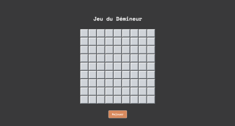
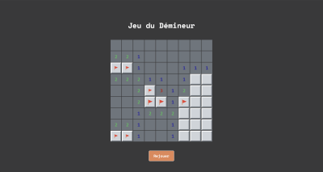
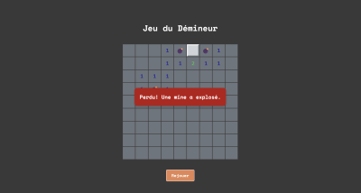
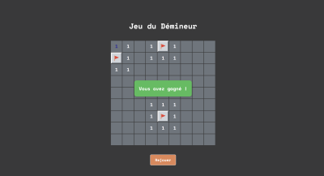

# Jeu du Démineur (Minesweeper) 💣😱💥

**Le but du jeu** est de dévoiler toutes les cases de la grille qui ne contiennent pas de mines/bombes.

## 1. Règles du jeu

- Si vous cliquez **(clic gauche)** sur une mine 💣, la partie est perdue.
- Une case chiffrée 2️⃣ indique le nombre de mines adjacentes.
- Une case vide ⬜ se dévoile automatiquement avec ses voisines.
- Vous pouvez placer un drapeau **(clic droit)** 🚩 pour marquer une case suspecte.

🏆 Vous gagnez en dévoilant toutes les cases sans mines.

---

## 2. Jouer au jeu

Ce jeu est codé en JavaScript et est déployé sur Netlify: **[🔗 jouer ici](https://jeu-du-demineur.netlify.app/)**

⚠️ **Ce jeu est optimisé pour ordinateur** car il nécessite un clic droit pour poser un drapeau. Il n'est pas jouable sur mobile ou tablette.

---

## 3. Aperçu 

<span style="display: flex;">
 
 
</span>
<span style="display: flex; margin-top:1rem; ">
 
 
</span>

---


## 4. Installation 

```
git clone `https://github.com/Melissa-code/Minesweeper.git`
cd Minesweeper
Ouvrir le fichier index.html dans le navigateur pour commencer à jouer
```

---

## 5. Technologies utilisées

- **JavaScript** pour la logique du jeu
- **HTML** pour la structure de la page
- **CSS** pour le design et la mise en page

---

## 6. Architecture du projet 

Le jeu suit une approche modulaire et maintenable:

- **Séparation des données et de l'affichage**
- **Algorithme de propagation récursif (Flood Fill)** pour dévoiler les cases vides
- **Gestion d'événements** (clic gauche, clic droit) pour l'interaction utilisateur
- **Déploiement** sur Netlify pour un accès en ligne rapide

---

## 7. Fonctionnalités principales

- Génération aléatoire de la grille avec positionnement des mines
- Système de drapeaux pour marquer les cases suspectes
- Révélation des cases adjacentes avec un algorithme de propagation
- Message de victoire ou de défaite
- Bouton "Rejouer" pour lancer une nouvelle partie

---

## 8. Explication du Code

Le jeu repose sur une matrice 2D représentant la **grille** et un **masque** pour gérer l'affichage des cases. Voici une explication détaillée des principales fonctions:

### 8.1. Initialisation du jeu

```
let largeur = 9, hauteur = 9, nbMines = 10;
let matrice = [], masque = []; 
```

**La matrice de jeu contient :**
- `0-8` pour le nombre de mines adjacentes
- `-1` pour une mine

**Le masque (la grille visible):** 
- `1` = case cachée
- `0`= case dévoilée
- `-1` = case marquée par un drapeau


### 8.2. Création de la grille

On initialise une matrice vide et on cache toutes les cases dans masque:

```
function initGame() {
  for (let i = 0; i < hauteur; i++) {
    let rowMasque = [];
    let rowMatrice = [];
    for (let j = 0; j < largeur; j++) {
      rowMasque.push(1);
      rowMatrice.push(1);
    }
    masque.push(rowMasque);
    matrice.push(rowMatrice);
  }
}
```

### 8.3. Placement aléatoire des mines

On place les mines aléatoirement dans la matrice sans superposition:

```
function placerMines() {
  let intervalle = largeur * hauteur;
  for (let i = 0; i < nbMines; i++) {
    let positionMine;
    let row, col;
    do {
      positionMine = Math.floor(Math.random() * intervalle);
      row = Math.floor(positionMine / largeur);
      col = positionMine % largeur;
    } while (matrice[row][col] == -1);
    matrice[row][col] = -1;
  }
}
```

**Explication:**
- On choisit une case au hasard.
- Si elle ne contient pas déjà une mine `-1`, on y place une mine.


### 8.4. Décompte des mines adjacentes

Chaque case affiche un nombre représentant le nombre de mines adjacentes:

```
function remplir_chiffres() {
  for (i = 0; i < matrice.length; i++) {
    for (let j = 0; j < matrice[i].length; j++) {
      if (matrice[i][j] == -1) {
        continue;
      } else {
        let vecteurVoisinage = voisinages_lineaires(i, j);
        let counterMines = 0;
        for (let k = 0; k < vecteurVoisinage.length; k++) {
          let row = Math.floor(vecteurVoisinage[k] / largeur);
          let col = vecteurVoisinage[k] % largeur;
          if (matrice[row][col] == -1) {
            counterMines++;
          }
        }
        matrice[i][j] = counterMines;
      }
    }
  }
}
```

### 8.5. Gestion des clics

**1. Clic gauche** correspond à révéler une case: 

```
function jouer(i, j) {
  if (partieTerminee) return;

  if (masque[i][j] != 1) return; 

  if (matrice[i][j] == -1) {
    devoilerToutesLesMines();
    afficherMessagePerdu();
    partieTerminee = true;
  } else {
    devoilerVoisinage(i, j);
  }

  displayGrid();
}
```

**Explication :**

- Si c'est une mine, c'est la fin de la partie, 
- Sinon, on dévoile la case et les cases adjacentes si nécessaire (Algorithme de Flood Fill).


**2. Clic droit** pour poser ou enlever un drapeau

```
function afficheDrapeau(event) {
  event.preventDefault();

  if (partieTerminee) return;

  const cell = event.target; 
  if (cell.classList.contains("cell_devoilee")) return;
  
  if (cell.classList.contains("cell_drapeau")) {
    cell.classList.remove("cell_drapeau"); 
    cell.textContent = "";
  } else {
    nbDrapeaux++;
    cell.classList.add("cell_drapeau"); 
    cell.textContent = drapeau;
  }
  verifierGagnant();
}
```

**Explication :**

- On alterne entre poser et enlever un drapeau 🚩.
- On vérifie si toutes les mines sont bien marquées.

---

### 8.6. Algorithme de propagation (Flood Fill)

Lorsqu'on clique sur une case vide, toutes les cases adjacentes vides sont dévoilées automatiquement: 

```
function devoilerVoisinage(i, j) {
  masque[i][j] = 0;
  if (matrice[i][j] != 0) {
    return;
  } else {
    let casesVoisines = voisinages_lineaires(i, j);
    for (let k = 0; k < casesVoisines.length; k++) {
      let i1 = Math.trunc(casesVoisines[k] / largeur);
      let j1 = casesVoisines[k] % largeur;
      if (masque[i1][j1] == 1 && matrice[i1][j1] != -1)
        devoilerVoisinage(i1, j1); // récursive
    }
  }
}
```

**Explication :**

- Si la case est vide (0), on dévoile récursivement ses voisins.
- C'est un algorithme de remplissage (Flood Fill) similaire à l'outil ["Seau de peinture" de Photoshop](https://helpx.adobe.com/fr/photoshop/using/tool-techniques/paint-bucket-tool.html).


### 8.7. Vérification de victoire

```
function verifierGagnant() {
  if (nbDrapeaux !== nbMines) return;
  let minesMarqueesParDrapeaux = true;
  for (let i = 0; i < hauteur; i++) {
    for (let j = 0; j < largeur; j++) {
      // Si mine et pas marquée par un drapeau
      if (matrice[i][j] === -1 && !document.getElementById(i + "-" + j).classList.contains("cell_drapeau")) {
        minesMarqueesParDrapeaux = false;
        break;
      }
    }
    if (!minesMarqueesParDrapeaux) break; 
  }
  if (minesMarqueesParDrapeaux) {
    console.log("Toutes les mines sont marquées par un drapeau, gagné!");
    afficherMessageGagnant();
    devoilerCasesSansMines();
    partieTerminee = true;
  }
}
```

**Explication :**

Le joueur gagne si toutes les cases sans mines sont révélées.


### 8.8. Affichage et mise à jour de la grille

```
function displayGrid() {
  for (let i = 0; i < hauteur; i++) {
    for (let j = 0; j < largeur; j++) {
      let cell = document.getElementById(i + "-" + j);
      effacerStyle(cell);
      //  1 (voile), 0 (afficher), -1 (drapeau)
      switch (masque[i][j]) {
        case 1:
          cell.classList.add("cell_cachee");
          break;
        case 0:
          cell.classList.add("cell_devoilee");
          if (matrice[i][j] > 0) {
            cell.textContent = matrice[i][j];
            cell.classList.add("couleur" + matrice[i][j]);
          }
          if (matrice[i][j] == -1) {
            cell.textContent = bombe;
          }
          break;
        case -1:
          cell.classList.add("cell_drapeau");
          break;
      }
    }
  }
}
```

**Explication :**

Met à jour l'affichage en fonction du masque (0, 1, -1).

---


## 9. Conclusion 

Ce projet met en pratique des concepts clés en algorithmique et développement web :

- Manipulation des tableaux 2D
- Algorithme récursif (Flood Fill)
- Gestion des événements utilisateurs
- Manipulation du DOM en JavaScript

---

## 10. Author 

- Melissa-code


